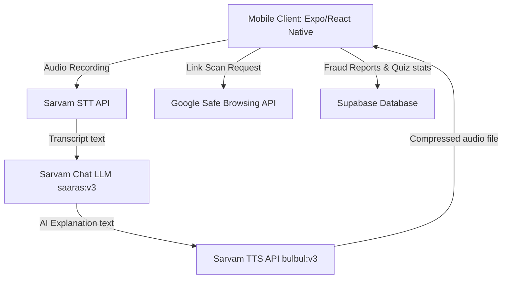

# 🛡️ CyberSaathi

> **Empowering India's Next Billion Users to Detect and Prevent Cyber Fraud**

[](https://reactnative.dev/)
[](https://expo.dev/)
[](https://supabase.com/)
[](https://www.typescriptlang.org/)
[](https://opensource.org/licenses/MIT)

**CyberSaathi** is a voice-first, multilingual mobile application built to tackle the rising epidemic of digital fraud in India. Traditional cybersecurity tools rely on complex text and technical jargon, which fail users with lower digital literacy. CyberSaathi bridges this gap by leveraging advanced **Voice AI** to provide an accessible, conversational, and gamified defense mechanism against modern scams.

---

## 🚀 Core Features

### 🎙️ Multilingual AI Voice Assistant (Voice Chat)
Powered by the **Sarvam AI** voice pipeline, users can simply tap a microphone and describe a suspicious situation in their native language (Hindi, Marathi, Bengali, Tamil, Telugu, or English). 
*   **Speech-to-Text (STT):** Translates regional dialects and speech patterns.
*   **Contextual Reasoning:** Uses deep learning to identify psychological manipulation tactics (urgency, digital arrest, fear).
*   **Text-to-Speech (TTS):** Synthesizes a natural, local-language voice response explaining the risk.

### 🔍 Advanced Link & Content Scanner
Analyzes links and messages before the user clicks on them:
*   **Threat Intelligence:** Real-time lookup against the **Google Safe Browsing API**.
*   **Heuristics Engine:** Scans for look-alike domains, SMS spoofing, and zero-day phishing patterns.

### 🎭 Live AI Scam Simulator (Roleplay)
A cutting-edge roleplay simulator designed to build muscle memory:
*   **Interactive Simulation:** The AI acts as an aggressive scammer (e.g., a power grid support agent threatening disconnection).
*   **Adaptive Difficulty:** Evaluates user responses in real-time.
*   **Performance Report:** Generates a detailed **Cybersecurity Report** highlighting missed red flags.

### 🏆 Gamified Learning & Badges
*   **Daily Quizzes:** Evaluates knowledge on digital arrests, OTP frauds, and job scams.
*   **Cloud Progress:** Unlocks achievements and tracks levels securely in the cloud.

### 📊 Community Fraud Reporting
Allows users to anonymously report scam numbers, UPI IDs, links, and financial losses to help map regional cybercrime patterns.

---

## 🏗️ Technical Architecture

### Architecture Diagram


### Tech Stack
*   **Frontend:** React Native, Expo (Managed Workflow), TypeScript, React Navigation
*   **UI/UX:** Custom Dark Theme, MaterialIcons, optimized view layout rendering
*   **Audio Engines:** `expo-audio` (low-latency preheated recording session, mono compression)
*   **Database:** Supabase PostgreSQL with Row Level Security (RLS)
*   **AI Integration:** Sarvam AI (Speech-to-Text, Chat Completion, Text-to-Speech)

---

## 🛠️ Getting Started

### Prerequisites
*   [Node.js](https://nodejs.org/) (v18 or higher)
*   [Expo CLI](https://docs.expo.dev/get-started/installation/)
*   A physical Android/iOS device with the [Expo Go](https://expo.dev/client) app installed (for local testing)

### Installation

1.  **Clone the repository:**
    ```bash
    git clone https://github.com/legend12309/cybersarthi.git
    cd cybersarthi
    ```

2.  **Install dependencies:**
    ```bash
    npm install
    ```

3.  **Environment Setup:**
    Create a `.env` file in the root directory:
    ```env
    EXPO_PUBLIC_SUPABASE_URL=your_supabase_url
    EXPO_PUBLIC_SUPABASE_ANON_KEY=your_supabase_anon_key
    EXPO_PUBLIC_SARVAM_API_KEY=your_sarvam_api_key
    EXPO_PUBLIC_SAFE_BROWSING_API_KEY=your_google_safe_browsing_key
    ```

4.  **Database Provisioning:**
    Copy the SQL definitions from [supabase_setup.sql](file:///D:/CyberSaathi/supabase_setup.sql) into your Supabase SQL Editor and run it to set up the schemas, tables, and RLS policies.

5.  **Run Locally:**
    ```bash
    npx expo start -c
    ```
    Scan the generated QR code using the Expo Go app on your phone.

---

## 📦 Building for Production (APK)

CyberSaathi is configured for EAS (Expo Application Services) builds.

### Triggering Cloud Builds (EAS)
1.  Initialize/Link the project with your Expo account:
    ```bash
    eas project:init
    ```
2.  Trigger the Android preview build (generates a downloadable APK):
    ```bash
    eas build -p android --profile preview
    ```

### Compiling Locally
To bypass cloud queues and build the APK locally on your machine (requires Android Studio, Android SDK, and JDK installed):
```bash
eas build --platform android --local --profile preview
```

---

## 🔒 Security & Privacy

*   **Anonymous UUIDs:** The app uses hardware-level UUIDs (`expo-application`) to track user levels and badge status anonymously. No personal sign-ups or credentials are required, protecting victims' privacy.
*   **Row-Level Security (RLS):** Supabase database tables use strict RLS policies, permitting read-only lookups on global tables and allowing only anonymous insert operations for reports.

---

## 📜 License
This project is licensed under the MIT License - see the [LICENSE](file:///D:/CyberSaathi/LICENSE) file for details.
